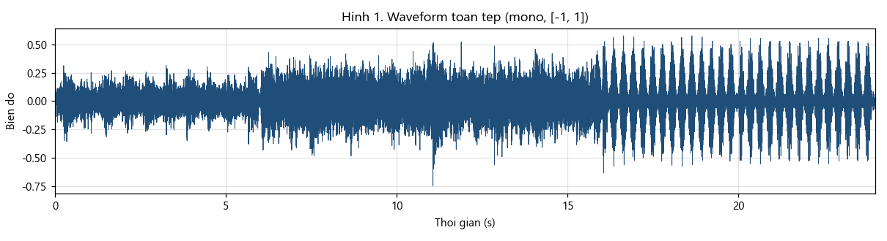
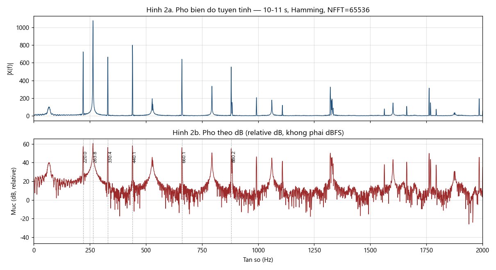
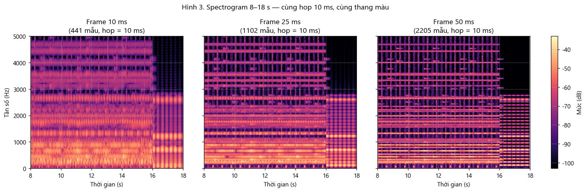
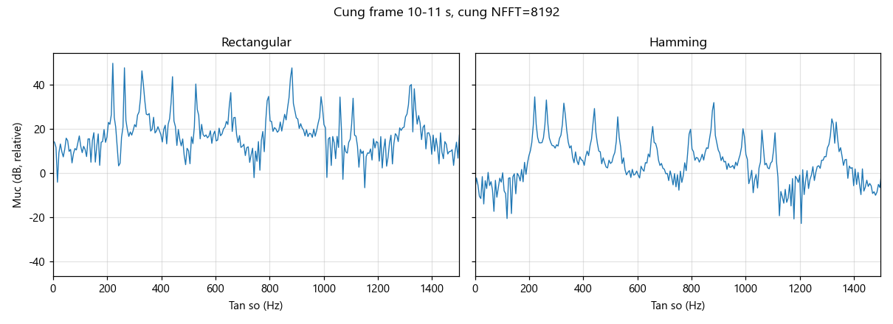
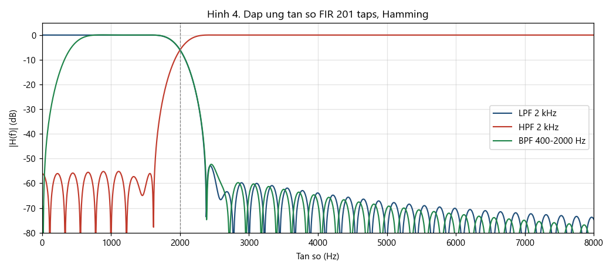
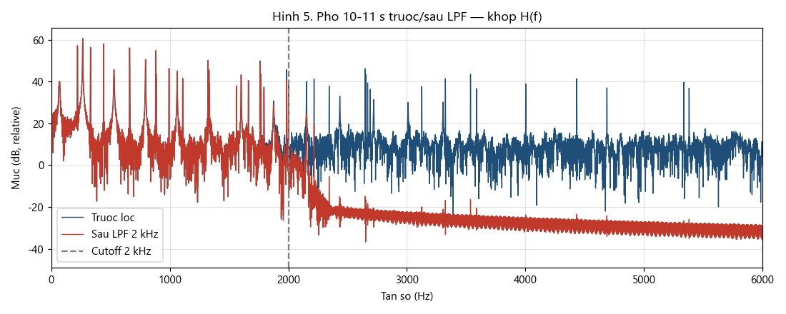
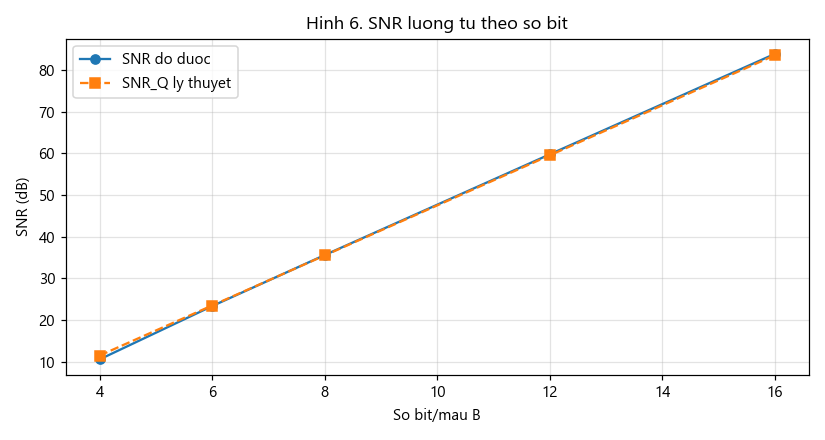
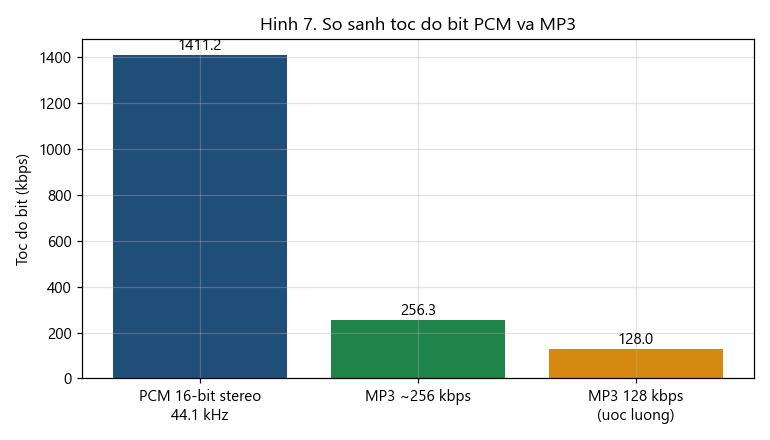

# CSE457 · Lab 1 — Phân tích và xử lý tín hiệu âm thanh số

**Học phần:** CSE457 – Xử lý âm thanh và tiếng nói  
**Sinh viên:** Vũ Xuân Sang  -  2351260685  
**Nộp bài:** Jupyter Notebook — chạy **Run All** từ đầu đến cuối

Pipeline của Lab:

```text
Audio → số hóa → miền thời gian → FFT → STFT/cửa sổ → lọc FIR → lượng tử / resample / mã hóa
```

| File chính | Vai trò |
|------------|---------|
| [`Lab01.ipynb`](Lab01.ipynb) | Toàn bộ bài thực hành A → G |
| [`report_Lab01.md`](report_Lab01.md) | Hướng dẫn chi tiết + nhận xét + câu hỏi báo cáo |
| [`requirements.txt`](requirements.txt) | Thư viện Python cần cài |

---

## 1. Chạy notebook

```bash
pip install -r requirements.txt
```

Mở `Lab01.ipynb` trong VS Code hoặc Jupyter, chọn kernel Python 3, rồi **Run All**.

Notebook **tự tạo** file âm thanh (không dùng file mẫu của đề), sau đó phân tích, vẽ hình và xuất WAV/MP3 vào `audio/`.

Tín hiệu tự tạo, 24 giây, stereo, 44.1 kHz, PCM 16-bit:

- **0–16 s:** nhạc, F0 = 220 Hz (A3)
- **16–24 s:** tiếng nói tổng hợp, F0 = 120 Hz

---

## 2. Cấu trúc thư mục

```text
A-AP_Lab_1/
├── Lab01.ipynb              # code nộp bài
├── report_Lab01.md          # báo cáo / hướng dẫn
├── requirements.txt
├── README.md
├── audio/
│   ├── input_stereo.wav     # gốc PCM
│   ├── lab01_original.mp3   # bản nén ~256 kbps
│   ├── filtered_*.wav       # sau lọc FIR
│   ├── quantized_*bit.wav   # 4 / 6 / 8 / 12 / 16 bit
│   └── resampled_*.wav      # 16 kHz và 8 kHz
└── figures/
    ├── waveform.png
    ├── fft.png
    ├── spectrogram.png
    ├── filter_response.png
    └── ...
```

---

## 3. Nội dung A → G

### A. Đọc dữ liệu

$F_s = 44100$ Hz, stereo, 16 bit/mẫu, 24 s. Chuẩn hóa $[-1,1]$, chuyển mono bằng trung bình hai kênh. Nyquist = 22.05 kHz. Peak ≈ 0.80, RMS ≈ 0.137 (−17.3 dBFS), không clipping.

### B. Miền thời gian

Waveform toàn tệp và hai đoạn 1 giây (nhạc thưa 1–2 s vs hòa âm dày 10–11 s).



### C. FFT

Đoạn ổn định 10–11 s, cửa sổ Hamming. Đỉnh phổ ≈ **220, 264, 330, 440, 660, 880 Hz** (A3 và harmonic). Tăng NFFT chỉ làm trục Hz mịn hơn, không tăng độ phân giải vật lý.



### D. STFT / spectrogram

Frame 10 / 25 / 50 ms, **cùng hop 10 ms và cùng thang màu**. Cửa sổ ngắn → thời gian sắc; cửa sổ dài → tần số sắc.



### E. Cửa sổ Rectangular vs Hamming

Hamming giảm spectral leakage (side-lobe thấp) nhưng main-lobe rộng hơn.



### F. Lọc FIR

Ba bộ FIR 201 taps, Hamming: LPF 2 kHz, HPF 2 kHz, BPF 400–2000 Hz. Group delay ≈ 2.27 ms (đã bù khi so phổ).





### G. Lượng tử hóa, resampling, mã hóa

SNR tăng gần 6 dB/bit. Resample 16 kHz / 8 kHz bằng `resample_poly` (có anti-alias). PCM 1411.2 kbps vs MP3 ~256 kbps → compression ratio ≈ **5.51 : 1**.

| Bit/mẫu | SNR đo (dB) |
|--------:|------------:|
| 4 | 10.6 |
| 8 | 35.6 |
| 16 | 83.8 |





---

## 4. Nghe thử

| File | Nghe để kiểm tra |
|------|------------------|
| `audio/input_stereo.wav` | Tín hiệu gốc |
| `audio/music_lpf_2k.wav` | Low-pass 2 kHz — âm tối hơn |
| `audio/quantized_4bit.wav` | Nhiễu lượng tử rõ |
| `audio/resampled_8000.wav` | Mất dải trên 4 kHz |

---

## 5. Lưu ý kỹ thuật

- Không FFT cả bài rồi kết luận “tần số xuất hiện lúc nào” → dùng STFT.
- Không tăng NFFT rồi viết “độ phân giải vật lý tăng”.
- Không downsample bằng `x[::k]` (thiếu lọc anti-alias).
- Không lấy file MP3 làm ground truth lossless.
- Khi so mẫu trước/sau FIR phải bù group delay.
